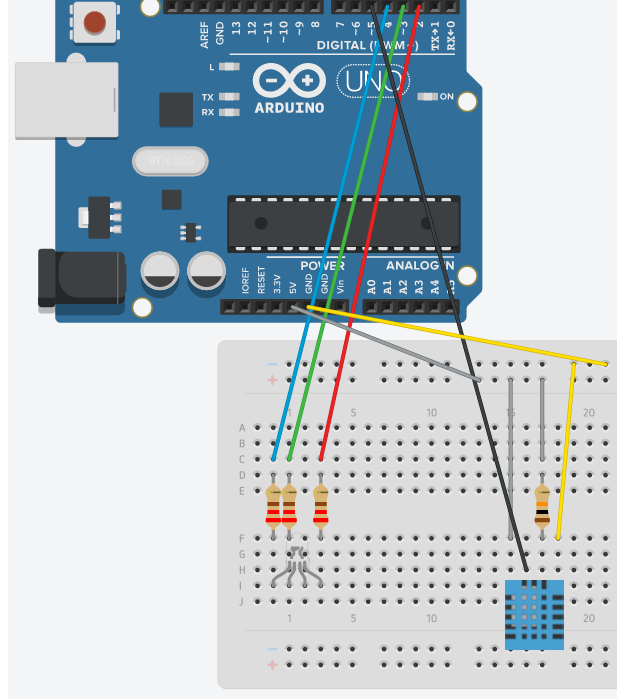

## Humidity monitor with arduino

#### A humidity monitor with arduino, DHT11 sensor and led rgb that shows you if the humidity in your local is between 30-50%, bellow 30% or higher than 50%.

---

### How it works

#### First we include the DHT sensor library, define the pin where the sensor is (in this case port 5) and the DHT type (in this case DHT11). Then we define the pins where the terminals in the rgb led are, start the serial, start the DHT sensor and put the pins of the rgb led in output mode. In the loop we define that every 100ms(1 second) the sensor will measure the humidity. If the returned value is not a number it will read it again. If it is a number it will continue and then print on the serial the value found. Then the led will turn to the colors:

-  When the humididty is equal or between 30-50%
-  When the humidity is bellow 30%
-  When the humidity is higher than 50%

---

### Components

- Arduino UNO R3(or compatible with)
- DHT11 sensor
- Led rgb
- Resistors 220 ohms 3x
- Resistor 10k ohms
- Jumpers
- Breadboard

---

### Circuit

---

### Libraries

- [DHT Sensor library](https://github.com/adafruit/DHT-sensor-library)
- [Adafruit Unified Sensor Driver](https://github.com/adafruit/Adafruit_Sensor)
